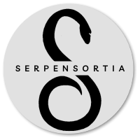

# Serpensortia :snake:

<p align="center"></p>

Proyecto para el curso React.JS en la carrera <a href="https://www.coderhouse.com/online/carrera-online-desarrollo-fullstack" target="_blank">Desarrollo Full Stack</a> de Coderhouse (2023).

Las imágenes de los productos fueron extraídas de la Tienda Oficial <a href="https://harrypottershop.co.uk/" target="_blank">Harry Potter Shop</a>.

# Folder Structure :open_file_folder:

```bash
├── README.md
├── package-lock.json
├── package.json
├── public
│   ├── img
│   ├── favicon.png
│   ├── index.html
│   ├── manifest.json
│   └── robots.txt
└── src
    ├── App.css
    ├── App.js
    ├── catalogo.js
    ├── components
    │   ├── Cart
    │   │   ├── Cart.css
    │   │   └── Cart.js
    │   ├── CartItem
    │   │   ├── CartItem.css
    │   │   └── CartItem.js
    │   ├── CartWidget
    │   │   ├── CartWidget.css
    │   │   └── CartWidget.js
    │   ├── Item
    │   │   ├── Item.css
    │   │   ├── Item.js
    │   │   └── assets
    │   │       └── BackgroundProductos.png
    │   ├── ItemCount
    │   │   ├── ItemCount.css
    │   │   └── ItemCount.js
    │   ├── ItemDetail
    │   │   ├── ItemDetail.css
    │   │   └── ItemDetail.js
    │   ├── ItemDetailContainer
    │   │   └── ItemDetailContainer.js
    │   ├── ItemList
    │   │   └── ItemList.js
    │   ├── ItemListContainer
    │   │   └── ItemListContainer.js
    │   └── Navbar
    │       ├── Navbar.css
    │       ├── Navbar.js
    │       └── assets
    │           └── Logo.png
    ├── context
    │   └── CartContext.js
    ├── index.js
    └── services
        └── config.js
```

# Tech :computer:
- HTML5
- CSS3
- JavaScript ES6
- React JS
- Bootstrap
- Firebase
- Github